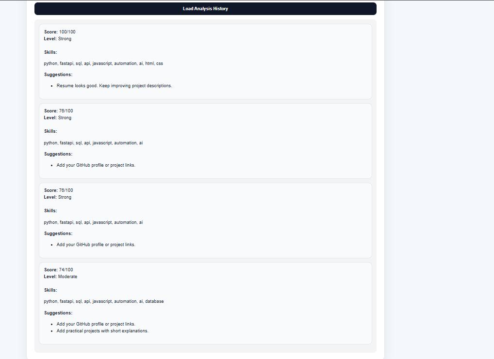
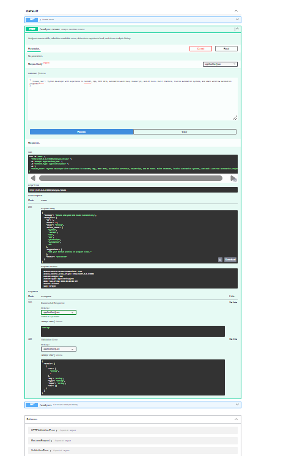

<<<<<<< HEAD

---

# 4. AI RESUME ANALYZER README

```md
# AI Resume Analyzer

## Overview

The AI Resume Analyzer is an intelligent recruitment automation platform designed to analyze resumes, extract candidate information, and generate AI-powered evaluation insights.

The system automates recruitment workflows using NLP and LLM-based analysis.

---

## Problem Statement

Manual resume screening requires significant time and effort during recruitment processes.

Organizations need scalable systems to automate candidate analysis and improve hiring efficiency.

---

## Solution

The platform analyzes resumes using AI-powered workflows, structured data extraction, and intelligent evaluation systems.

---

## Key Features

- Resume parsing
- AI-powered candidate analysis
- Intelligent scoring system
- Structured data extraction
- Recruitment workflow automation
- REST API integration
- Database support

---

## Technologies Used

- Python
- OpenAI API
- NLP libraries
- FastAPI / Flask
- PostgreSQL / MongoDB
- JSON workflows

---

## Workflow

1. Resume uploaded
2. System extracts resume content
3. AI analyzes candidate profile
4. Candidate evaluation generated
5. Results stored and displayed

---

## Architecture Diagram


Resume Upload → Parser → AI Analysis → Candidate Evaluation → Database → Results Dashboard

---

## Technical Challenges

- Resume parsing accuracy
- AI scoring consistency
- Data extraction reliability
- Workflow scalability
- API optimization

---

## Future Improvements

- ATS integration
- Semantic job matching
- Vector database support
- Multi-language analysis
- Candidate ranking system

---

## Screenshots


---

## Demo Video

[Watch Demo](YOUR_DEMO_LINK)

---

## Installation

```bash
git clone YOUR_REPOSITORY_LINK
cd ai-resume-analyzer
pip install -r requirements.txt
python app.py
=======
# AI Resume Analyzer


## Overview

AI Resume Analyzer is an AI-powered candidate evaluation and resume analysis platform designed to automate resume scoring, technical skill detection, candidate classification, and hiring recommendation workflows.

The system demonstrates practical implementation of AI-style evaluation workflows for recruitment operations using FastAPI, SQLite, and frontend dashboard automation.

## Problem Statement

Recruiters and hiring teams manually review large numbers of resumes daily.

Manual candidate evaluation creates challenges including:

- inconsistent resume screening
- delayed candidate filtering
- inefficient skill matching
- difficulty prioritizing applicants
- repetitive hiring workflows

## Solution

This platform automates candidate evaluation workflows by:

- analyzing resume content
- detecting technical skills
- calculating candidate scores
- determining experience level
- generating hiring suggestions
- storing resume evaluation history

## Key Features

- AI-style resume analysis
- Candidate scoring engine
- Technical skill detection
- Resume evaluation workflows
- Hiring recommendation generation
- Resume analysis history
- FastAPI backend APIs
- Interactive frontend dashboard
- Swagger API documentation
- SQLite database integration
- Workflow automation simulation

## Technologies Used

- Python
- FastAPI
- SQLAlchemy
- SQLite
- HTML
- CSS
- JavaScript
- REST APIs
- Uvicorn

## System Workflow

1. User submits candidate resume
2. Backend analyzes resume content
3. Workflow engine detects technical skills
4. Candidate score calculated
5. Experience level determined
6. AI suggestions generated
7. Resume analysis stored in database
8. Hiring workflow history becomes available for review

## Architecture Diagram


```text
Frontend Dashboard
        ↓
FastAPI Backend
        ↓
Resume Analysis Engine
        ↓
SQLite Database
        ↓
Candidate Review UI
```

## API Endpoints

| Method | Endpoint | Description |
|---|---|---|
| GET | `/` | Health check |
| POST | `/analyze-resume` | Analyze candidate resume |
| GET | `/analyses` | Load resume analysis history |

## Example Request

```json
{
  "resume_text": "Python developer with experience in FastAPI, SQL, REST APIs, automation workflows, JavaScript, and AI tools."
}
```

## Example Response

```json
{
  "message": "Resume analyzed and saved successfully",
  "analysis": {
    "id": 1,
    "score": 74,
    "level": "Moderate",
    "skills_found": [
      "python",
      "fastapi",
      "sql",
      "api",
      "javascript",
      "automation",
      "ai",
      "database"
    ],
    "suggestions": [
      "Add your GitHub profile or project links.",
      "Add practical projects with short explanations."
    ],
    "status": "processed"
  }
}
```

## Screenshots

### Dashboard


### Analysis Result


### Analysis History



### API Documentation



## Demo Video

[Watch Demo Video](demo/ai-resume-analyzer-demo.mp4)

## Installation

Clone repository:

```bash
git clone https://github.com/NASRATULLAH786/ai-resume-analyzer.git
cd ai-resume-analyzer
```

Create virtual environment:

```bash
python -m venv venv
```

Activate virtual environment:

```bash
venv\Scripts\activate
```

Install dependencies:

```bash
pip install -r requirements.txt
```

Run backend:

```bash
uvicorn app.main:app --reload --port 8083
```

Open API documentation:

```text
http://127.0.0.1:8083/docs
```

Open frontend:

```text
frontend/index.html
```

## Environment Variables

Create local `.env` file:

```env
GROQ_API_KEY=
DATABASE_URL=sqlite:///./resume_analysis.db
MODEL_NAME=llama3-70b-8192
APP_ENV=development
```

## Technical Challenges

- Resume skill extraction
- Candidate scoring workflows
- Experience classification
- Frontend/backend synchronization
- Resume evaluation consistency
- Database persistence
- Error handling

## Future Improvements

- Real LLM integration
- PDF resume upload support
- OCR-based resume extraction
- Recruiter dashboard
- Multi-candidate comparison
- Resume ranking system
- Cloud deployment
- Analytics dashboard

## Project Impact

This project demonstrates practical AI automation engineering skills including:

- backend API development
- workflow automation
- AI evaluation systems
- operational workflow design
- frontend/backend integration
- database-driven workflow systems
- candidate analysis automation
>>>>>>> 3d821fb (Finalize AI resume analyzer project)
