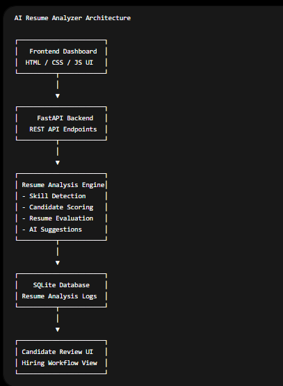

# AI Resume Analyzer


## Overview

AI Resume Analyzer is an AI-powered candidate evaluation and resume analysis platform designed to automate resume scoring, technical skill detection, candidate classification, and hiring recommendation workflows.

The system demonstrates practical implementation of AI-style evaluation workflows for recruitment operations using FastAPI, SQLite, and frontend dashboard automation.

---

## Problem Statement

Recruiters and hiring teams manually review large numbers of resumes daily.

Manual candidate evaluation creates challenges including:

- inconsistent resume screening
- delayed candidate filtering
- inefficient skill matching
- difficulty prioritizing applicants
- repetitive hiring workflows

---

## Solution

This platform automates candidate evaluation workflows by:

- analyzing resume content
- detecting technical skills
- calculating candidate scores
- determining experience level
- generating hiring suggestions
- storing resume evaluation history

---

## Key Features

- AI-style resume analysis
- Candidate scoring engine
- Technical skill detection
- Resume evaluation workflows
- Hiring recommendation generation
- Resume analysis history
- FastAPI backend APIs
- Interactive frontend dashboard
- Swagger API documentation
- SQLite database integration
- Workflow automation simulation

---

## Technologies Used

- Python
- FastAPI
- SQLAlchemy
- SQLite
- HTML
- CSS
- JavaScript
- REST APIs
- Uvicorn

---

## System Workflow

1. User submits candidate resume
2. Backend analyzes resume content
3. Workflow engine detects technical skills
4. Candidate score calculated
5. Experience level determined
6. AI suggestions generated
7. Resume analysis stored in database
8. Hiring workflow history becomes available for review

---

## Architecture Diagram



```text
Frontend Dashboard
        ↓
FastAPI Backend
        ↓
Resume Analysis Engine
        ↓
SQLite Database
        ↓
Candidate Review UI