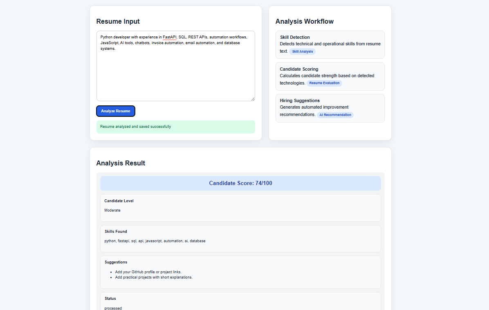

---

# 4. AI RESUME ANALYZER README

```md
# AI Resume Analyzer

## Overview

The AI Resume Analyzer is an intelligent recruitment automation platform designed to analyze resumes, extract candidate information, and generate AI-powered evaluation insights.

The system automates recruitment workflows using NLP and LLM-based analysis.

---

## Problem Statement

Manual resume screening requires significant time and effort during recruitment processes.

Organizations need scalable systems to automate candidate analysis and improve hiring efficiency.

---

## Solution

The platform analyzes resumes using AI-powered workflows, structured data extraction, and intelligent evaluation systems.

---

## Key Features

- Resume parsing
- AI-powered candidate analysis
- Intelligent scoring system
- Structured data extraction
- Recruitment workflow automation
- REST API integration
- Database support

---

## Technologies Used

- Python
- OpenAI API
- NLP libraries
- FastAPI / Flask
- PostgreSQL / MongoDB
- JSON workflows

---

## Workflow

1. Resume uploaded
2. System extracts resume content
3. AI analyzes candidate profile
4. Candidate evaluation generated
5. Results stored and displayed

---

## Architecture Diagram


Resume Upload → Parser → AI Analysis → Candidate Evaluation → Database → Results Dashboard

---

## Technical Challenges

- Resume parsing accuracy
- AI scoring consistency
- Data extraction reliability
- Workflow scalability
- API optimization

---

## Future Improvements

- ATS integration
- Semantic job matching
- Vector database support
- Multi-language analysis
- Candidate ranking system

---

## Screenshots





---

## Demo Video

[Watch Demo](YOUR_DEMO_LINK)

---

## Installation

```bash
git clone YOUR_REPOSITORY_LINK
cd ai-resume-analyzer
pip install -r requirements.txt
python app.py
